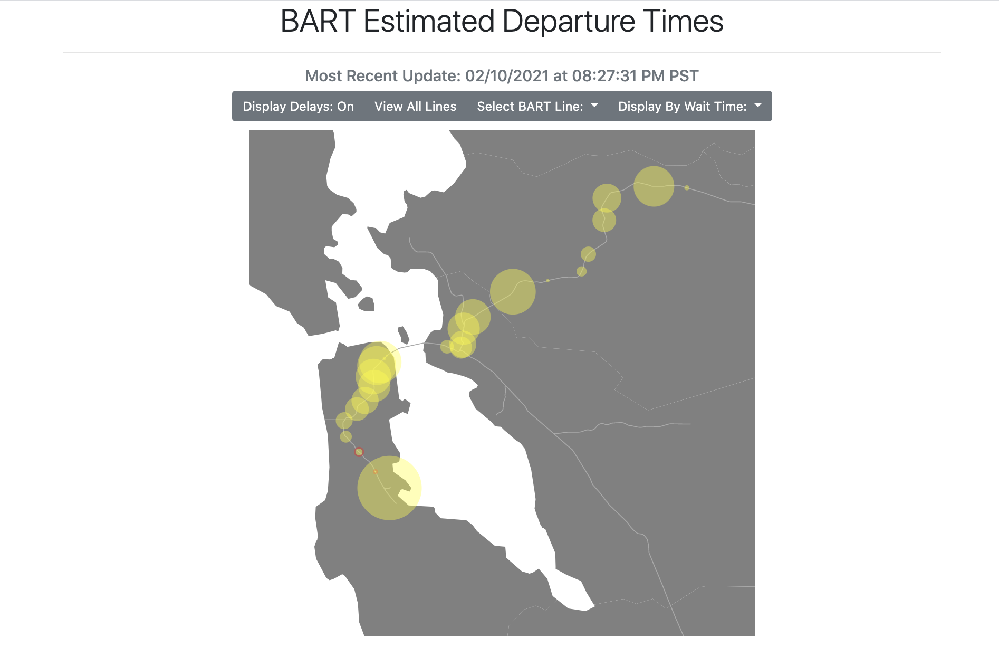

#  Estimated Time of Restoration Visualization 

Interactive visualization for Bay Area Rapid Transit (BART) estimated departure times. This project combines my love for programming with my passion for public transportation.

Users can use the toolbar at the top of the screen to change displays. Display
options: 
* toggle displays
* display specific BART line
* display by estimated departure time

The application uses [Javascript D3](https://d3js.org/) to spatially visualize departure times at
each station in the network. It includes topojson data and geographic
projections as well as axios calls to the [BART Api](http://api.bart.gov/docs/overview/index.aspx). The project was created
during a 2-day Hackathon, at the end of which I presented a lightning talk on
the project.

You can view a deployed version [here](http://claire-casey-bart.surge.sh/).

## Installation and Setup Instructions

1. Clone this repository
2. Serve on a simple server:
    * `python3 -m http.server`

## Technologies Used

* [Javascript D3](https://d3js.org/) - library used to create visualizations
* [jQuery](https://jquery.com/) - library used for DOM manipulation

